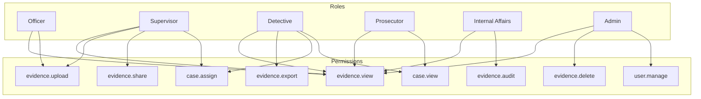
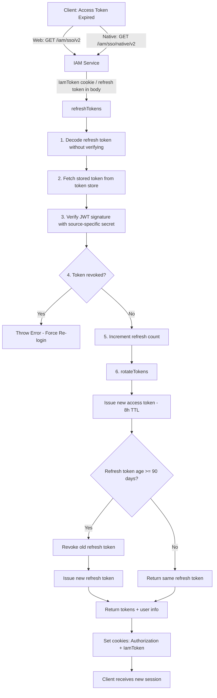

## The Bug That Taught Me Everything

A few months ago, I watched a team spend three weeks debugging a "simple" permissions issue. A user couldn't access their company's dashboard, but could access their personal one. Same email. Same password. Same human.

The root cause? The system treated "user" and "account" as the same thing. One database table. One identity. And when that person belonged to two organizations, the system had a meltdown.

This is the IAM problem nobody gets right on the first try. Let me save you the three weeks.

## User vs. Account: The Boundary Nobody Draws

Here's the distinction that changes everything:

**A User is a human.** One person. One identity. They have credentials (email, password, OAuth tokens). They exist exactly once in your system, regardless of how many things they have access to.

**An Account is a context.** It's a workspace, an organization, a tenant. It has its own data, its own billing, its own permissions. A single User can belong to many Accounts.

Think about how Google works:
- You have ONE Google identity (your Gmail login)
- That identity accesses YouTube, Drive, Maps, Calendar, all different "products"
- But you might also have a Google Workspace account through your employer
- Same login. Different context. Different data. Different permissions.

That's not magic. That's proper IAM architecture.

## The Three-Layer Model

Here's how I design IAM systems now:

### Layer 1: Identity Service

This is the "who are you?" layer. It handles:
- Authentication (password, OAuth, SAML, passkeys)
- Credential storage (hashed passwords, linked social accounts)
- Session management (tokens, refresh cycles)
- MFA/2FA

One record per human. Period. This service doesn't know about your app's business logic. It doesn't know what an "organization" is. It just answers: "Is this person who they claim to be?"

### Layer 2: Account/Tenant Service

This is the "where do you belong?" layer:
- Organizations, workspaces, teams
- Billing entities
- Data isolation boundaries

A User can be a member of many Accounts. Each membership has a *role*, but the role is scoped to that Account, not global.

### Layer 3: Authorization Service

This is the "what can you do?" layer:
- Permissions within an Account
- Role definitions (admin, editor, viewer)
- Resource-level access control

The key insight: authorization is *always contextual*. "Can this user delete files?" is the wrong question. "Can this user delete files *in this account*?" That's the right one.

## The Centralized Login Pattern

Now for the part everyone struggles with: how do you maintain one login across multiple apps?

Google does this with a pattern I call **centralized identity, federated sessions**.

Here's how it works:

**1. Single Sign-On Domain**

All authentication goes through ONE domain. For Google, it's `accounts.google.com`. It doesn't matter if you're trying to access YouTube or Gmail. The login always happens at the same place.

**2. Session Cookie at the Identity Layer**

When you authenticate, the Identity Service sets a session cookie on its own domain. This cookie says "this browser belongs to user X." It doesn't say anything about which app they're using.

**3. Token Exchange Per App**

When you navigate to YouTube, YouTube doesn't check its own auth. It redirects to the Identity Service, which sees the existing session cookie and says "oh, you're already logged in," then issues a *scoped token* for YouTube specifically.

The user never sees a login screen. It looks seamless. But under the hood, each app got its own token with its own permissions.

**4. Consent and Scope**

Sometimes the app needs extra permissions. "YouTube wants to access your Google Drive." The Identity Service handles that consent flow too. It's the single source of truth for what each app can access.

## Real-World RBAC: Lessons from Axon

Before I get into common mistakes, let me share something that shaped how I think about permissions.

At Axon (the company behind body cameras and digital evidence management for law enforcement), I worked on a system where getting permissions wrong wasn't just a bug. It was a liability. Imagine a piece of body camera evidence that might be relevant to a criminal case. Who should see it?

- The officer who recorded it
- Their supervisor
- The assigned detective
- The prosecutor's office
- Defense attorneys (with restrictions)
- Internal affairs (for misconduct reviews)

Every single one of these people needs *different* access to the *same* evidence. And if you accidentally leak footage to the wrong party? That's a mistrial. That's someone's life.

### Composite Permission Strings

The pattern that worked beautifully was **composite permission strings**: `resource.action` scoped to a role.

```
officer.evidence.view
officer.evidence.upload
supervisor.evidence.view
supervisor.evidence.share
detective.evidence.view
detective.evidence.export
admin.evidence.delete
prosecutor.evidence.view
ia.evidence.view
ia.evidence.audit
```

Each permission is atomic and composable. A role is just a *collection* of these permissions. You never check "is this person a supervisor?" You check "does this person have `evidence.view` permission in this context?"

### The Permission Graph

Here's how the role-based access flows:



### Why This Works

**Granularity without chaos.** You're not creating a role for every edge case. You're composing permissions like Lego blocks. Need a new role for "external auditor"? Just pick the permissions they need: `evidence.view` + `evidence.audit`. Done.

**Deny by default.** If a permission string doesn't exist in someone's role, they can't do it. No ambiguity. No "well, admins can probably do everything" assumptions.

**Audit trail.** When someone accesses evidence, you log exactly which permission string authorized it. Six months later, when a lawyer asks "who viewed this file and why were they allowed to?" you have the answer in one query.

This experience taught me that RBAC isn't just about "admin vs viewer." In high-stakes domains, the permission model IS the product's integrity.


### Mistake 1: User table has `organization_id`

The moment you put an `organization_id` on your users table, you've limited every user to one org. Refactoring this later is painful. It touches every query in your system.

Use a junction table: `account_memberships (user_id, account_id, role)`.

### Mistake 2: Permissions in the Identity Service

Your auth service should NOT know that "editors can publish posts." That's business logic. Keep the Identity Service dumb. It authenticates. A separate Authorization Service decides what authenticated users can do.

### Mistake 3: App-specific login flows

Every time you build a new product within your company and give it its own login page, you're creating fragmentation. Users accumulate accounts they forget about. Password resets become confusing.

One login. Always. Even for internal tools.

### Mistake 4: Storing roles globally

"Admin" means nothing without context. Admin of what? The whole platform? One workspace? One project? Roles must be scoped to an Account or resource.

## The Data Model (Simplified)

Here's what the core tables look like:

```
identities
├── id (UUID)
├── email
├── password_hash
├── mfa_secret
└── created_at

accounts
├── id (UUID)
├── name
├── plan (billing tier)
└── created_at

memberships
├── identity_id → identities.id
├── account_id → accounts.id
├── role (admin | member | viewer)
└── joined_at

sessions
├── id (UUID)
├── identity_id → identities.id
├── token_hash
├── expires_at
└── device_info

oauth_connections
├── identity_id → identities.id
├── provider (google | github | saml)
├── provider_user_id
└── access_token (encrypted)
```

Notice: `identities` knows nothing about accounts. `accounts` knows nothing about identities. The `memberships` table is the bridge. Clean separation.

## The Refresh Token Flow (In Practice)

Theory is great, but let me show you how token refresh actually works in a production IAM system I've worked on. This is the flow that keeps users logged in without asking for credentials every 8 hours.

The system supports both web clients (cookie-based) and native apps (token in body), with a smart rotation strategy that balances security and UX.



### Why This Design Is Smart

**Decode without verifying first.** This sounds scary, but it's intentional. The payload tells you *which* secret to use for verification (different sources: web, iOS, Android use different signing keys). You can't verify without knowing the source.

**Fast token store for revocation.** Refresh tokens are long-lived (90 days), so you need a way to revoke them instantly. Whether you use Redis, DynamoDB, or a document store, the key requirement is O(1) lookup by token ID. Revocation checks must be fast and cheap because they happen on every refresh.

**Refresh count tracking.** Every time a token is refreshed, the count increments. If you see a token being refreshed 500 times in an hour from different IPs, that's token theft. The count is your anomaly detection signal.

**Conditional rotation at 90 days.** This is the sweet spot between security and UX. Rotating refresh tokens on every request creates race conditions in mobile apps (what if two API calls refresh simultaneously?). Rotating at 90 days means the window of exposure is bounded, but you avoid the "two tabs fighting over tokens" problem.

**Source-specific secrets.** Web and native apps have different threat models. A web token stolen via XSS is different from a native token stolen via device compromise. Different secrets mean revoking one platform doesn't nuke the other.

### Room for Improvement

No system is perfect. Here's what I'd push for depending on business needs:

**Shorter access token TTL for sensitive operations.** 8 hours is fine for reading dashboards. But for actions like deleting evidence or exporting PII? Consider step-up authentication: require a fresh token (or re-auth) for high-risk operations, even if the current session is valid.

**Token binding to device fingerprint.** Right now, a stolen refresh token works from any device. Binding tokens to a device fingerprint (or at minimum, checking for sudden geo/IP shifts) adds a layer of protection without hurting UX for legitimate users.

**Graceful token family revocation.** If a refresh token is used twice (replay attack), revoke the entire token family, every session that branched from the original login. This is aggressive but appropriate for high-stakes domains. The trade-off is legitimate users occasionally getting logged out on flaky networks.

**Observability-driven rotation.** Instead of a fixed 90-day rotation, rotate based on risk signals: new IP, new device, unusual access pattern, long inactivity followed by sudden burst. This makes the system adaptive rather than calendar-driven.

**Federated token exchange for microservices.** As the platform grows, internal services shouldn't pass the user's access token around. Implement token exchange (RFC 8693) so services get their own scoped tokens when acting on behalf of a user. This limits blast radius if one service is compromised.

## When to Split Into Microservices

For most teams, this can start as one service with clear internal boundaries. But when should you split?

**Split the Identity Service when:**
- Multiple products need to share login (the Google model)
- You need to support enterprise SSO (SAML/OIDC federation)
- Auth needs to scale independently from your app

**Split the Authorization Service when:**
- Permission logic becomes complex (RBAC to ABAC to ReBAC)
- Multiple services need to check permissions consistently
- You want to change permission models without redeploying everything

**Keep it together when:**
- You have one product with simple roles
- Your team is small and velocity matters more than purity
- You're pre-product-market-fit (you'll rebuild anyway)

## The Lesson

IAM is one of those things where getting the data model right early saves you months later. The User vs Account distinction seems philosophical until the day you need multi-tenancy, and then it's either a clean migration or a six-month rewrite.

Draw the boundary. Separate identity from authorization. Centralize login.

Your future self, the one debugging a permissions issue at 2 AM, will thank you.
