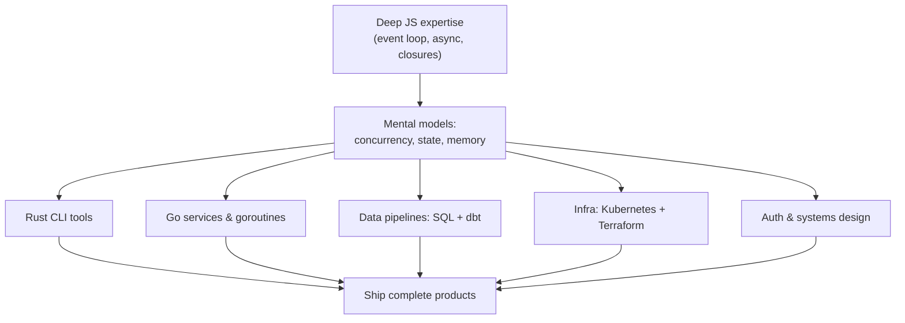

## The Flex That Stopped Flexing

I used to be *that* guy in interviews.

"Explain the difference between [microtasks and macrotasks](https://developer.mozilla.org/en-US/docs/Web/API/HTML_DOM_API/Microtask_guide)." Easy. "What's the output of this Promise chain?" Child's play. "How does the [event loop](https://developer.mozilla.org/en-US/docs/Web/JavaScript/Reference/Execution_model) prioritize [`queueMicrotask`](https://developer.mozilla.org/en-US/docs/Web/API/Window/queueMicrotask) vs `setTimeout`?" I could draw the diagram from memory.

JavaScript fundamentals were my identity. I'd spent years understanding [prototypal inheritance](https://developer.mozilla.org/en-US/docs/Web/JavaScript/Inheritance_and_the_prototype_chain) at a molecular level. [WeakMaps](https://developer.mozilla.org/en-US/docs/Web/JavaScript/Reference/Global_Objects/WeakMap), [generators](https://developer.mozilla.org/en-US/docs/Web/JavaScript/Reference/Global_Objects/Generator), [proxy traps](https://developer.mozilla.org/en-US/docs/Web/JavaScript/Reference/Global_Objects/Proxy). I didn't just use them, I *understood* them. It felt like a superpower.

Then, sometime in early 2024, I watched an AI assistant explain the event loop better than I ever could. In three seconds. To a junior who didn't even ask the right question.

And I felt... nothing? No. I felt *obsolete*.

## The Knowledge Commodity Crisis

Here's the thing nobody talks about: **deep knowledge of a single language is now a commodity.**

When any developer can ask an AI "write me an optimized debounce using microtask scheduling" and get a perfect answer with edge-case handling, what's the value of *being* the person who knows that?

I'm not saying fundamentals don't matter. They do, for intuition, for debugging, for knowing when the AI is wrong. But the *competitive advantage* of being a JavaScript wizard? That evaporated.

The interview question that used to stump 90% of candidates now gets solved by the candidate's AI assistant before they even walk in the room.

## The Identity Meltdown (Yes, I Had One)

I won't pretend I took this gracefully.

For about two months, I was angry. "These people don't even understand what they're generating." "They'll never debug a memory leak without understanding closures." Classic cope.

But then I started noticing something. The developers who were *shipping*, who were building full products, launching side projects, solving real business problems, they weren't the deepest JavaScript experts. They were generalists. They were *builders*.

They'd use AI to scaffold a backend in [Go](https://go.dev/). Then switch to designing a database schema. Then write a [Terraform](https://www.terraform.io/) config. Then sketch a UI. All in one afternoon.

And their output was... genuinely good.

The shift looks something like this, one deep skill becoming the root of a much wider tree:

The foundation didn't disappear. It became the trunk everything else grows from.

## The Door That Opened

Once I stopped grieving my JavaScript identity, I started experimenting.

**Week 1**: Built a CLI tool in [Rust](https://www.rust-lang.org/). Actual, working Rust. Me, a JavaScript developer who'd never touched a systems language. The AI handled the syntax; I handled the architecture and edge cases.

**Week 2**: Designed a proper IAM system with [OAuth2](https://oauth.net/2/) flows. Not just consuming an auth library, but actually understanding the protocol, the token lifecycle, the security implications.

**Week 3**: Set up a data pipeline with [BigQuery](https://cloud.google.com/bigquery) and [dbt](https://www.getdbt.com/). Wrote SQL that would've taken me months to learn organically.

**Week 4**: Deployed infrastructure with [Kubernetes](https://kubernetes.io/) manifests I actually understood, because I could ask "why" at every step.

I wasn't an expert in any of these. But I was *competent* in all of them. And competence across domains turned out to be wildly more valuable than mastery of one.

## The Builder Mindset

Here's what I realized: AI didn't kill expertise. It killed the *moat* around expertise.

What it created instead is a new role: **the builder**. Someone who:

- Understands systems thinking across the full stack
- Can evaluate AI output because they have broad context
- Moves between domains fluidly, connecting dots others can't see
- Ships complete solutions, not just features in isolation

A JavaScript expert builds JavaScript features. A builder builds *products*.

## The Irony

The funniest part? My JavaScript knowledge didn't become useless. It became the *foundation* for everything else.

Understanding async patterns made distributed systems intuitive. Knowing how the event loop works made me better at reasoning about Go's [goroutines](https://go.dev/tour/concurrency/1). The mental models transferred. They just stopped being the *destination* and became the *launchpad*.

## What I'd Tell Past Me

If you're sitting there right now, proud of your deep knowledge in one language, one framework, one domain: good. That foundation matters.

But don't mistake the foundation for the building.

AI is handing you the keys to become a complete engineer. Not by replacing what you know, but by removing the 10,000-hour barrier to everything else.

The question isn't "will AI replace my expertise?" It already did.

The real question is: **what will you build now that you can build anything?**

I chose to become a builder. And honestly? It's the most fun I've had in engineering since I wrote my first `console.log`.
