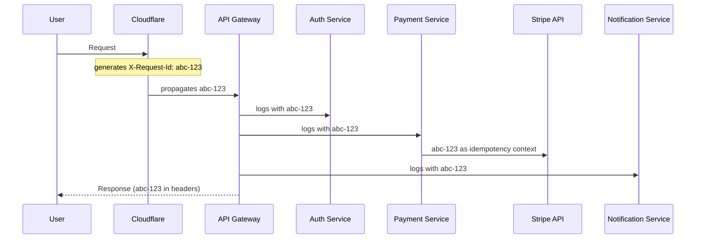
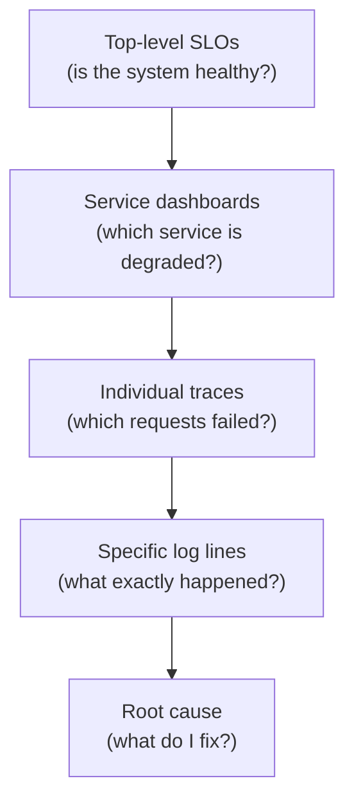

## The War Room That Shaped My Thinking

At Lazada (Alibaba Group), we had a war room culture. Every major feature deploy, the entire team sat in one room: engineers, QA, PMs, sometimes the VP. Screens everywhere. [Grafana](https://grafana.com/) dashboards, log streams, real-time transaction metrics.

The goal was simple: detect problems before users do. The moment a metric dipped, someone would call it out. "Payment success rate dropping in Indonesia." Heads turn. Someone pulls up traces. Someone checks the deploy diff. Within seconds, the room is narrowing down the cause.

It was intense. It was also the most effective incident detection I've ever seen. Not because of fancy tooling, but because *everyone was looking at the same data with the same context.*

That experience taught me: observability isn't about *having* logs. It's about whether your team can find the answer in under 5 minutes, whether they're in a war room together or alone at 3 AM on-call.

## The One ID That Rules Them All

The single most impactful thing you can do for observability: **pass a request ID from the very first entry point to the very last service.**

When a user hits your system, a unique [trace ID](https://opentelemetry.io/docs/concepts/signals/traces/) should be born at the edge (Cloudflare, your CDN, your API gateway) and travel through every single hop: load balancer, API service, queue, worker, database call, third-party API, response.



When something breaks, you search for ONE ID and see the entire journey. Every service it touched, every decision it made, every error it hit. No guessing. No correlating timestamps. One search.

This is what [OpenTelemetry](https://opentelemetry.io/) gives you for free if you follow the standard. [Traces, spans, context propagation](https://opentelemetry.io/docs/concepts/signals/traces/). Stop inventing your own correlation system. The industry solved this.

## First Question in Any Incident: What Changed?

Every time I join an incident call, the first thing I ask is: **"What changed in the last 2 hours?"**

Not "what's the error?" Not "which service is failing?" What *changed*. Because 95% of incidents are caused by a change: a deploy, a config update, a traffic spike, a dependency version bump, a feature flag flip.

A good observability system makes this trivial:
- Deployment markers on your dashboards (vertical lines showing when deploys happened)
- Config change audit logs with diffs
- Traffic anomaly detection (did request volume spike 10x?)
- Dependency health checks (did a third-party API start timing out?)

But deploys aren't the only changes. You need to look wider:

**What experiments are running?** A/B tests and feature flags scoped to a specific market or user segment can cause localized failures that look weird in global metrics. "Payment failures spiked in Germany" might just be the new checkout flow experiment hitting an edge case for German bank redirects.

**Is an external service having an outage?** Your payment provider, your CDN, your email sender, your SMS gateway. Check their status pages. Sometimes the problem isn't yours at all, but your logs are screaming because a dependency is down.

**Is an internal job the culprit?** Secret rotation, certificate renewal, PCI compliance scanning, database migrations, cron jobs that run at odd hours. I've seen incidents caused by the security team's quarterly PCI scan hitting APIs so aggressively it looked like a DDoS. Or a secret rotation that temporarily invalidated tokens across services.

The best incident responders don't just check "what code changed?" They check the full environment: experiments, external dependencies, and internal scheduled work.

If your team can't answer "what changed?" in 60 seconds, you need better tooling.

## The AI Crawling Problem Nobody Talks About

Here's a 2025 reality: AI bots are hammering your APIs.

I've seen services where 40% of traffic was AI crawlers. Not malicious. Just aggressive. They scrape your public pages, hit your APIs at rates no human ever would, and generate *massive* volumes of logs that look like real errors.

One "user" generating 50,000 requests per minute. Your error logs show a 500 spike. You panic. Turns out it's a single bot retrying failures in a tight loop.

Your observability needs to distinguish between:
- Real user traffic vs bot traffic
- One user flooding errors vs a systemic failure
- Percentage of *actual humans* affected

The alert at 3 AM should say: "Payment failures at 15%, affecting 2,300 real users in the last 5 minutes." Not: "5,000 errors in the last minute" (which might be one bot).

## Quiet Hour Alerts: Context Is Everything

Getting paged at 3 AM should require proof of real impact. My rules:

1. **What percentage of real users are affected?** If it's 0.01%, it can wait until morning.
2. **Is the error rate growing or stable?** A flat 2% error rate at 3 AM is probably the same bug that existed at 3 PM. A spike from 0.1% to 5%? That's real.
3. **Is it one user or many?** A single user hitting a retry loop can generate thousands of errors. That's not an incident. That's rate limiting.

Build dashboards that show *user impact percentage*, not raw error counts. A healthy alert says: "3.2% of users in checkout are failing" not "427 errors in the last 5 minutes."

## Zoom Out, Then Zoom In

A healthy observability system lets you:

**Zoom out:** See all traffic at a glance. What's the overall health? What percentage of requests are succeeding? Which services are degraded? Think of this as the satellite view. Traffic heatmaps, service dependency graphs, top-level SLOs.

**Zoom in:** Pick one user, one session, one request. See their exact journey through your system. Click by click. API call by API call. Like [Datadog RUM](https://docs.datadoghq.com/real_user_monitoring/) or FullStory, but connected to your backend traces.

The magic happens when you can go from "checkout success rate dropped 3%" to "here are the 50 users who failed, and here's exactly what happened in each of their sessions" in under 2 minutes.

This is the funnel: high-level metrics → service-level dashboards → individual traces → specific log lines. Each level should link to the next. No dead ends.



Each box drills one level deeper. The goal is a path from "something feels off" to "here is the broken line of code" without ever hitting a dead end.

## Meaningful Logs: Stop Logging Garbage

Here's a hard truth: most logs are useless. Teams log everything "just in case" and end up with:
- Logs nobody reads
- Storage bills that make finance cry
- So much noise that real signals drown

Every log line should answer: **"If I'm woken up at 3 AM and see only this line, can I understand what happened and what to do next?"**

Bad: `Error: something went wrong`
Bad: `Processing request for user`
Good: `Payment failed: stripe_charge_declined, user=u_123, amount=49.99€, card_last4=4242, retry=2/3`

That good log tells you: what happened, who's affected, the business context, and where we are in the retry logic. An on-call engineer (or an AI) can act on that immediately.

### Data Retention: Hot, Warm, Cold

Every organization has log storage costs. The strategy:

- **Hot (7 days):** Full detail, fast search. For active debugging.
- **Warm (30 days):** Indexed but slower. For trend analysis and post-mortems.
- **Cold (90+ days):** Compressed archives. For compliance and rare forensics.

To make this work, you need meaningful logs at every tier. If your hot logs are garbage, adding more retention days won't help. Clean up the signal first, then decide how long to keep it.

## Runbooks That Even AI Can Follow

I write runbooks with a specific audience in mind: someone who has never seen this service before. Because at 3 AM, that might be the person on-call.

A good runbook has:
1. **What is this alert?** One sentence explaining what the metric means in business terms.
2. **What's the likely cause?** Top 3 reasons this alert fires, ranked by probability.
3. **How do I verify?** Exact queries, dashboard links, commands to run.
4. **How do I fix it?** Step-by-step actions: rollback deploy, scale pods, toggle feature flag.
5. **Who do I escalate to?** If none of the above works, who owns this service?

Here's why this format matters: **AI is going to handle on-call soon.**

Not today. But soon, your first responder will be an AI agent that reads the alert, checks the runbook, verifies the dashboards, and takes the safe first action: rollback the last deploy, increase HPA replicas, restart a pod, disable a feature flag.

If your runbook is clear enough for a junior engineer with no context, it's clear enough for AI. Start writing them that way now.

## The AI On-Call Future

I genuinely believe that within a couple of years, the first line of incident response will be automated:

```
Alert fires → AI agent activates
  → Checks: what changed? (last deploy, config, traffic spike)
  → Checks: how many users affected? (real impact %)
  → If < 0.1% → suppress, create ticket for morning
  → If deploy-correlated → auto-rollback, notify team
  → If resource-based → scale HPA, add pods
  → If unknown → escalate to human with full context summary
```

For this to work, your system needs:
- Clear deployment annotations
- Real user impact metrics (not just error counts)
- Runbooks in a structured, parseable format
- Safe rollback mechanisms ([canary deploys](https://martinfowler.com/bliki/CanaryRelease.html), [feature flags](https://martinfowler.com/articles/feature-toggles.html))
- Permission boundaries (what can AI touch vs what needs human approval)

The teams that invest in good observability now are the ones that will benefit most from AI ops later.

## Why This Matters (The Business Case)

At Lazada (Alibaba Group), we had a KPI: zero P0 incidents per team per month. A P0 meant checkout was down, or payments were failing, or the homepage wasn't loading. Every minute of P0 was tracked and reported to the CEO's dashboard.

When your incident costs $50,000 per minute in lost revenue, the ROI of investing in observability is *trivially* obvious. But even at smaller companies:

**Faster incident resolution:** Good observability cuts [MTTR](https://en.wikipedia.org/wiki/Mean_time_to_repair) from hours to minutes. That's real money saved and real customers retained.

**Understanding your users:** When you can trace a user's full journey, you stop guessing why they drop off. You *see* it. The button that doesn't respond. The API that times out. The flow that confuses.

**Confidence when shipping:** In a world where AI is writing more and more implementation code, observability becomes your safety net. You might not have written the code, but you can *see* if it's working correctly in production. Ship fast, observe immediately, rollback if needed.

## The Checklist

If you're starting from zero, here's your priority order:

1. **Request ID propagation** from edge to every service ([OpenTelemetry](https://opentelemetry.io/))
2. **Deployment markers** on all dashboards
3. **User impact percentage** in alerts, not raw error counts
4. **Structured logs** with business context (who, what, why, how bad)
5. **Zoom out/zoom in** capability (high-level [SLOs](https://sre.google/sre-book/service-level-objectives/) to individual traces)
6. **Runbooks** that a stranger (or an AI) can follow
7. **Data retention strategy** that balances cost vs usefulness
8. **Bot detection** to separate real user signals from noise

Get these right, and your 3 AM self will actually be able to fix things. Get these wrong, and you'll spend 38 minutes scrolling through logs while the business bleeds.

Don't be 2019 me. Build the system that makes incidents boring.
