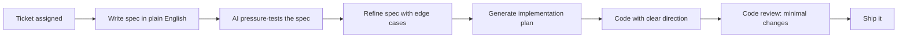
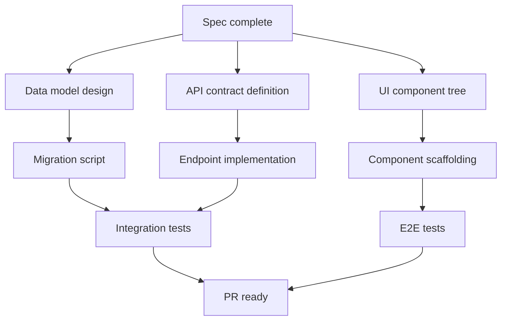

# Spec First, Code Second — How AI Flipped My Workflow

I have a confession: I used to be a "figure it out while coding" engineer. Open the IDE, start typing, refactor three times, realize I missed a requirement, refactor again. Ship it Friday. Hotfix Monday.

It worked. Sort of. Until AI tools made me realize how much time I was wasting by thinking *in code* instead of thinking *before code*.

## The old way (aka "vibes-driven development")

Here's how a feature used to go:

```mermaid
graph LR
    A[Ticket assigned] --> B[Open IDE immediately]
    B --> C[Start coding]
    C --> D[Hit edge case]
    D --> E[Refactor]
    E --> F[Hit another edge case]
    F --> G[Refactor again]
    G --> H[Code review: "what about X?"]
    H --> I[More refactoring]
    I --> J[Ship it]
```

Notice how many loops there are? Every "refactor" is me discovering something I should have thought about before writing a single line.

## The new way (spec-first with AI)

Now my workflow looks like this:



Fewer loops. Less rework. The thinking happens upfront, where it's cheap to change your mind.

## What a "spec" actually looks like

Nothing fancy. I'm not writing 20-page design docs. It's literally a markdown file:

```markdown
## Feature: User notification preferences

### What
Users can choose which notifications they receive (email, push, in-app)
and set quiet hours.

### Constraints
- Must work offline (queue changes, sync when online)
- Cannot break existing notification pipeline
- Must be reversible (undo within 5 minutes)

### Edge cases
- What if user disables ALL notifications? Show warning but allow it.
- What if quiet hours span midnight? Store as two ranges.
- What if push permission is revoked at OS level? Degrade gracefully.
```

That takes 10 minutes to write. But it saves hours of "oh wait, what about..." during implementation.

## Where AI transforms this

The magic isn't in AI writing the spec. It's in AI *challenging* the spec.

I paste my spec and ask: "What am I missing? What edge cases haven't I considered? What will break at scale?"

Every single time, it catches something I missed. Not because AI is smarter — but because I have blind spots, and AI is a relentless rubber duck that never gets tired of asking "but what if...?"

## The implementation plan

After the spec is solid, I ask AI to help me break it into tasks:



Each box is a focused task. No ambiguity. No "figure it out as you go." Just execution.

## The counterintuitive truth

This workflow *feels* slower at the start. You're writing instead of coding. Your PR count goes down on day one.

But by day three? You've shipped more, with fewer bugs, and zero "oh we need to redesign this" conversations in code review.

The total time from ticket to production dropped by about 40% for me. Not because I code faster — but because I code *once*.

## When to skip it

I'm not a zealot. Quick bug fixes? Just fix them. Obvious changes? Just make them. One-line config updates? Don't write a spec for that, please.

The spec-first approach shines when:
- The feature has unknowns
- Multiple systems are involved
- Other people need to review or extend your work
- You catch yourself thinking "this might be tricky"

If it might be tricky — it is. Write the spec.

## The bigger picture

AI didn't just give me a code assistant. It gave me a *thinking* assistant. And it turns out, the bottleneck in software engineering was never typing speed. It was always clarity of thought.

Spec first. Think hard. Then code fast.

---

*Try it for one week: before you open the IDE, spend 15 minutes writing what you're about to build. Just plain English. I bet you'll ship faster.*
